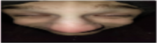

# Arkanoid

 
<i><b>[🚧 Game will receive updates in the future depending on the additional functionalities i would like to implement 🚧]</b></i>

## Features

### Bricks

The game includes eight different types of bricks, each with unique characteristics and properties. The table below provides an overview of the bricks' colors, required hits to destroy them, points earned, and buff drop rates:

| Color       | Times to Hit  | Points | Buff Drop Rate |
| ----------- | ------------- | ------ | -------------- |
| Yellow      | 2             | 20     | 0.1            |
| Green       | 1             | 10     | 0.1            |
| Blue        | 1             | 10     | 0.02           |
| Red         | 1             | 50     | 0.02           |
| Light Blue  | 1             | 10     | 0.02           |
| Light Green | 1             | 10     | 0.05           |
| Black       | 4             | 50     | 0.05           |
| Gray        | 1,000,000,000 | 0      | 0.05           |

It is worth noting that on every level you will encounter so called special brick (it will activate every buff available in the game), you can recognize it beacuse it in fact is not normal colored brick, but stupid image of the face of my friend:

  

### Buffs

The game introduces five different types of buffs that can enhance gameplay. Each buff has a specific color, description, and image associated with it. The table below provides an overview of the available buffs:

| Color   | Description                                                     | Image                                                                                            |
| ------- | --------------------------------------------------------------- | ------------------------------------------------------------------------------------------------ |
| Red     | Enhances your paddle speed                                      |        |
| Green   | Adds one life                                                   |            |
| Blue    | Enhances your ball and paddle speed by small amounts            |          |
| Yellow  | I dont now what this buff should do, so for now it does nothing |  |
| Magenta | Extends paddle by 50% |      |

### Grid Resizing

The game allows for resizing the grid of bricks. You can render a grid of up to 20 x 10 bricks, providing flexibility in level design and gameplay experiences.

### Collision Sound

During collisions between the ball and bricks or other objects, a sound effect is played. You can choose from a variety of sound options to customize the auditory experience of the game.

### Volume Controls

The project includes options to adjust the volume of both the music and sound effects. You can lower or increase the volume levels according to your preference, enhancing the overall gameplay experience.

### Backend

To run the full version of the game, a backend is required. The backend provides additional functionality and supports features such as level creation, user profiles, and score tracking. Instructions for setting up the backend will be provided separately.

### Level Editor

The Level Editor project provides a powerful tool for creating and customizing your own levels in the Arkanoid game. With its user-friendly interface, you can unleash your creativity and design unique levels with various brick arrangements, challenges, and buff placements. The Level Editor empowers you to bring your imaginative ideas to life and share your custom levels with others.

To access the Level Editor and start creating your own levels, please visit the [Level Editor repository](https://github.com/pawelos231/arkanoid_level_editor).

Click on the image above to visit the Level Editor repository and explore its features.

Feel free to provide feedback, or share the custom levels you create. Let your creativity shine in the Arkanoid game with the Level Editor!

### Potential Future development plans

- Player-Created Levels: The game will be enhanced to provide the ability for players to save there own levels on there profiles.

- Overall Points Tracking: The project will include functionality to track and store players' overall points earned throughout their gameplay sessions. This feature will enable players to see their progress and potentially compete for high scores.

- Top 10 Players Display: The planned "stats" page will showcase the top 10 players based on their overall performance. This feature will add a competitive aspect and encourage players to strive for higher rankings.

## Conclusion

Arkanoid project aimed at recreating the classic game with added features, customization options, and enhanced gameplay experiences. Stay tuned for future updates and additions as the project evolves. Game was created without usage of any libraries that would make my job easier in any way, it is bare bones, html, css and typescript, well there is also three js for rendering menu view but i dont count that, beacuse it is only a view and not a game feature

Feel free to explore, contribute, and have fun with Arkanoid

Below, you will find a showcase of how information, songs, and sounds are handled, as well as a guide on creating new levels and playing them. Everything is built from scratch. During gameplay, only two types of buffs drop, and their distribution depends solely on the player's luck. Feel free to create diverse levels with blank bricks or even an "Amogus" level, as highlighted in the documentation example. The only thing truly holding you back from having fun is your imagination. Let's dive in and unlock the laughter-filled adventure that awaits!

https://github.com/pawelos231/Arkanoid/assets/93586648/ad242bde-7587-4766-9496-a8b802faeba7

https://github.com/pawelos231/Arkanoid/assets/93586648/b2b83800-8cf7-48b0-b553-cd9cbb5c69f8

https://github.com/pawelos231/Arkanoid/assets/93586648/64e99abc-05b1-47c1-bcae-9f3730efa965

for the purpose of more interesting gameplay the buff drop rate was increased to 50%, i am sorry for poor quality of recordings, but github only allows movies up to 10MB, which is pretty low, considering each video is about 1 minute long, also the level played in the gameplay showcase is different beacuse the other one was way too long xD
